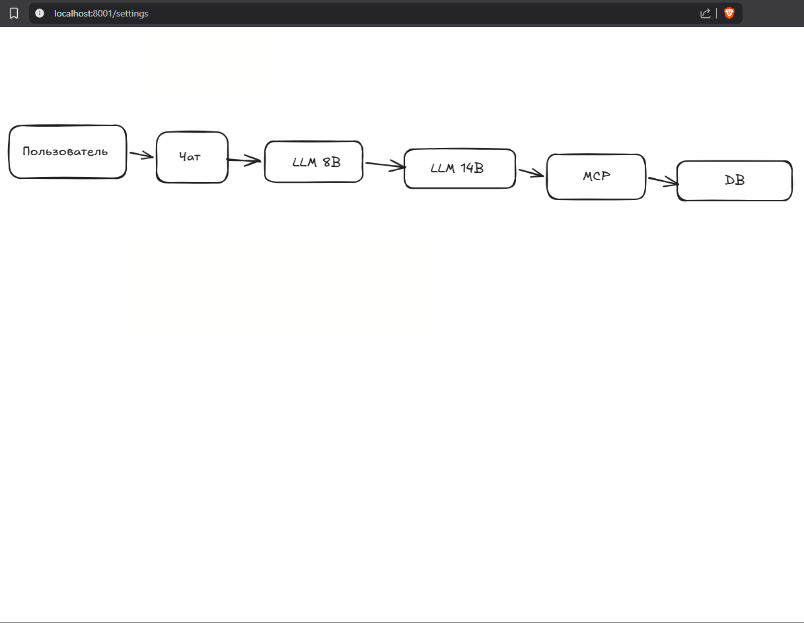

# 🌸 Magnolia — AI-агент для осознанного дня

Интерактивное приложение для анализа планетарных транзитов Human Design. Система помогает пользователям прожить энергию дня, предлагая диалог с ИИ, генерацию визуальных образов и аудио-рекомендации.

##  Описание

Magnolia — это мультиагентная система, объединяющая RAG-базу знаний канонических описаний транзитов с продвинутой логикой проверки ответов. Проект направлен на то, чтобы превратить абстрактные астрологические данные в персональные, практические советы для реальной жизни.

## 🚀 Как это работает

### 1. Выбор энергии дня
На главной странице пользователь видит актуальный список транзитов в формате `Планета в Ворота.Линия`. Каждая карточка содержит краткую суть энергии, чтобы вы сразу могли выбрать то, что откликается.

<p align="center">
  
</p>

### 2. Диалог с ИИ-наставником
После выбора темы открывается чат. Вы общаетесь с агентом на базе легкой модели (8B), описываете свои ситуации и ощущения. Агент помогает структурировать мысли и контекст.

<p align="center">
  
</p>

### 3. Администрирование и Логи
Для прозрачности работы системы предусмотрен административный дашборд. Здесь можно в реальном времени отслеживать логи работы моделей, запускать тесты (Benchmark) и проверять корректность ответов.

<p align="center">
  
</p>

## 🏗️ Архитектура и будущее развитие

### Текущая схема
Поток данных выстроен от пользователя через чат к цепочке моделей (8B → 14B), затем проходит валидацию через MCP-сервер и сохраняется в базе данных (SQLite).

<p align="center">
  
</p>

### Настройки и кастомизация
Приложение позволяет гибко настраивать URL моделей и переключаться между разными нейросетями (например, Qwen и Eva-Qwen) без изменения кода.

<p align="center">
  
</p>

### Планы развития (Roadmap)
Система готова к масштабированию. В следующей версии планируется интеграция **ComfyUI** для генерации визуальных метафор по транзиту (pic) и модуля **Text-to-Speech** для озвучивания советов (Audio).

<p align="center">
  
</p>

## ⚙️ Технический стек

| Компонент | Технология / Модель | Назначение |
| :--- | :--- | :--- |
| **LLM (Dialog)** | `qwen/qwen3-vl-8b` | Общение и сбор контекста |
| **LLM (Analysis)** | `eva-qwen2.5-14b-v0.2` | Генерация советов и анализ |
| **Backend** | MCP Server (Port 8002) | Валидация, оценка, фильтрация |
| **Database** | SQLite (`tips.db`) | Хранение уникальных советов |
| **UI** | Web Interface | Интерактивный фронтенд |

## 🔧 Быстрый старт

```bash
# 1. Клонируйте репозиторий
git clone https://github.com/Jui4an/hd-transit-agent.git
cd hd-transit-agent

# 2. Установите зависимости
pip install -r requirements.txt

# 3. Запустите приложение
python main.py
